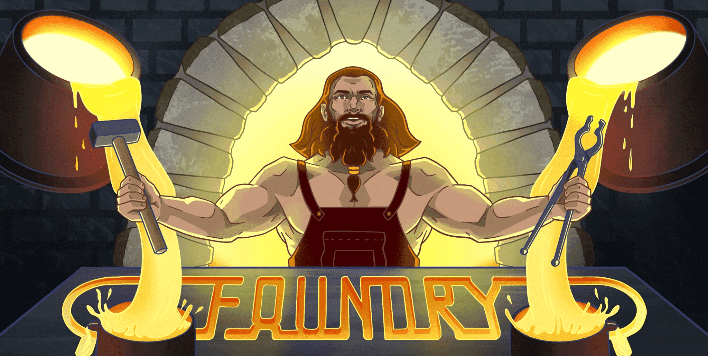

## Foundry

**Foundry es un conjunto de herramientas modular, portátil y ultrarrápido para el desarrollo de aplicaciones Ethereum escrito en Rust.**

Foundry consiste en:

-   **Forge**: Ethereum testing framework (como Truffle, Hardhat y DappTools).
-   **Cast**: Navaja suiza para interactuar con EVM smart contracts, enviar transacciones y obtener datos de la cadena..
-   **Anvil**: node local de Ethereum, similar Ganache, Hardhat Network.
-   **Chisel**: Rápida, utilitaria y detallado solidity REPL.

## Documentación

https://book.getfoundry.sh/

## Uso

### Build

```shell
$ forge build
```

### Test

```shell
$ forge test
```

Ejecutar test específico

```shell
$ forge test --match-contract ComplicatedContractTest --match-test testDeposit
```
Podemos ejecutar pruebas en nombres de archivos que coincidan con un patrón global con

```shell
$ forge test --match-path test/ContractB.t.sol
```

### Formatear

```shell
$ forge fmt
```

### Gas Snapshots

```shell
$ forge snapshot
```

### Anvil

```shell
$ anvil
```

### Deploy

```shell
$ forge script script/Counter.s.sol:CounterScript --rpc-url <your_rpc_url> --private-key <your_private_key>
```

### Cast

```shell
$ cast <subcommand>
```

### Help

```shell
$ forge --help
$ anvil --help
$ cast --help
```
